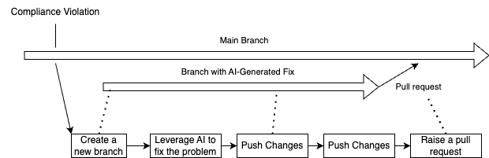

# ChatGPT Code Violation Fixer
This repository contains a script that automatically fixes code violations using ChatGPT and creates a pull request with the changes.

## Features

- Scans your codebase for violations
- Utilizes ChatGPT to generate fixes for detected violations
- Creates a pull request with the proposed changes

## Prerequisites

Python 3.7+
OpenAI API key
GitHub access token

## Installation

Clone this repository:
git clone https://github.com/yourusername/chatgpt-code-violation-fixer.git

Install the required dependencies:
pip install -r requirements.txt

Set up your environment variables:
export OPENAI_API_KEY="your-openai-api-key"
export GITHUB_TOKEN="your-github-access-token"

Usage
Run the script with:
Copypython fix_violations.py
Configuration
Modify the config.yml file to customize:

Target repository
Branch names
Violation detection rules
ChatGPT prompt templates